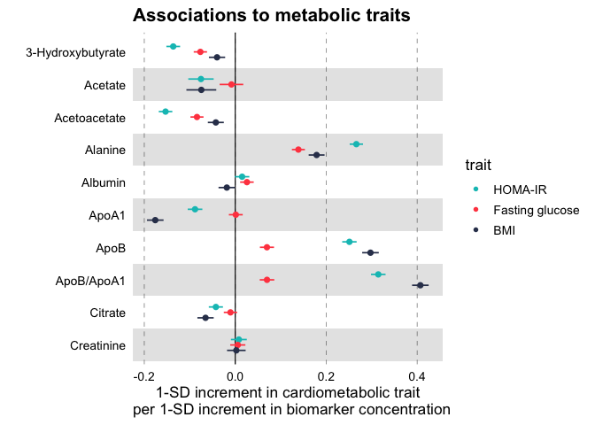
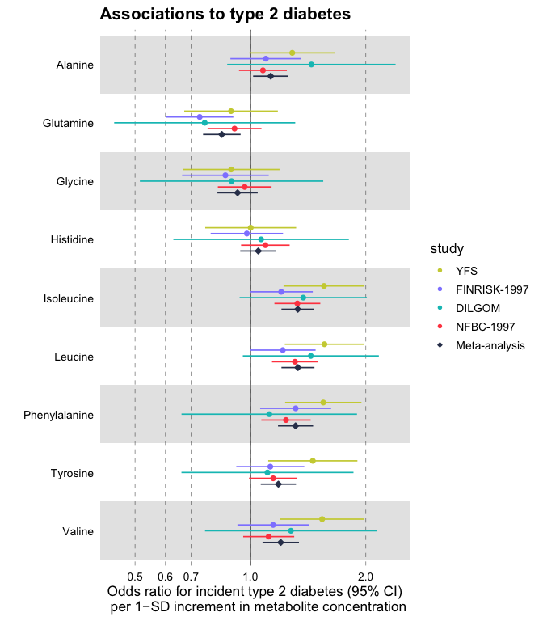

<!-- README.md is generated from README.Rmd. Please edit that file -->
<br>

<span><a href="https://nightingalehealth.github.io/ggforestplot/index.html">  </a>
<h2>
<strong>ggforestplot</strong>
</h2>
<h4>
Visualizing Measures of Effect
</h4>
</span>

<br>

`ggforestplot` is an R package for plotting measures of effect and their confidence intervals (e.g. linear associations or log and hazard ratios, in a forestplot layout, a.k.a. blobbogram).

The main plotting function is `ggforestplot::forestplot()` which will create a single-column forestplot of effects, given an input data frame.

In the package [webpage](https://nightingalehealth.github.io/ggforestplot/index.html), the two vignettes [Using ggforestplot](https://nightingalehealth.github.io/ggforestplot/articles/ggforestplot.html) and [NMR data analysis tutorial](https://nightingalehealth.github.io/ggforestplot/articles/nmr-data-analysis-tutorial.html) provide an introduction to creating forestplot visualizations with custom groupings and performing basic exploratory analysis (using demo metabolic data of the [Nightingale Health NMR platform](https://nightingalehealth.com/technology)).

Installation
------------

You can install `ggforestplot` from github as shown below (unless already installed, you need to first install `devtools`):

``` r
# install.packages("devtools")
devtools::install_github("NightingaleHealth/ggforestplot")
```

Examples
--------

Below we briefly showcase the usage of `ggforestplot` with publicly available datasets, which are also included in the package (see [A. V. Ahola-Olli et al. (2019)](https://www.biorxiv.org/content/10.1101/513648v1)).

### Linear associations

Plot a vertical forestplot for linear associations of blood biomarkers to insulin resistance (HOMA-IR), fasting glucose and Body Mass Index (BMI).

``` r
# Load tidyverse and ggforestplot
# install.packages("tidyverse")
library(tidyverse)
library(ggforestplot)

# Get subset of example, linear associations, data frame
df_linear <-
  ggforestplot::df_linear_associations %>%
  dplyr::arrange(name) %>%
  dplyr::filter(dplyr::row_number() < 30)

# Forestplot
forestplot(
  df = df_linear,
  estimate = beta,
  logodds = FALSE,
  colour = trait,
  title = "Associations to metabolic traits",
  xlab = "1-SD increment in cardiometabolic trait
  per 1-SD increment in biomarker concentration"
)
```



### Odds ratios

Plot a vertical forestplot for odds ratios of blood biomarkers with risk for future type 2 diabetes; visualize all 4 available cohorts and their meta-analysis.

``` r
# Get subset of example, log odds ratios, data frame
df_logodds <-
  df_logodds_associations %>%
  dplyr::arrange(name) %>%
  dplyr::left_join(ggforestplot::df_NG_biomarker_metadata, by = "name") %>% 
  dplyr::filter(group == "Amino acids") %>%
  # Set the study variable to a factor to preserve order of appearance
  # Set class to factor to set order of display.
  dplyr::mutate(
    study = factor(
      study,
      levels = c("Meta-analysis", "NFBC-1997", "DILGOM", "FINRISK-1997", "YFS")
    )
  )

# Forestplot
forestplot(
  df = df_logodds,
  estimate = beta,
  logodds = TRUE,
  colour = study,
  shape = study,
  title = "Associations to type 2 diabetes",
  xlab = "Odds ratio for incident type 2 diabetes (95% CI)
  per 1−SD increment in metabolite concentration"
) +
  # You may also want to add a manual shape scale to mark meta-analysis with a
  # diamond shape
  ggplot2::scale_shape_manual(
    values = c(23L, 21L, 21L, 21L, 21L),
    labels = c("Meta-analysis", "NFBC-1997", "DILGOM", "FINRISK-1997", "YFS")
  )
```


